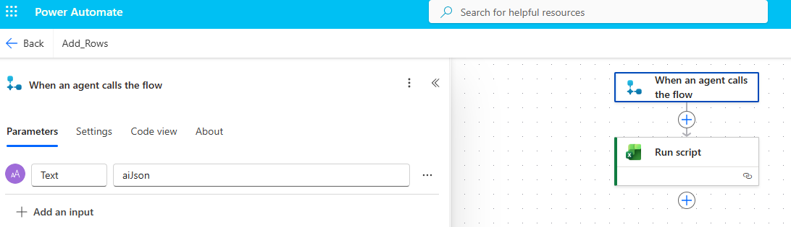
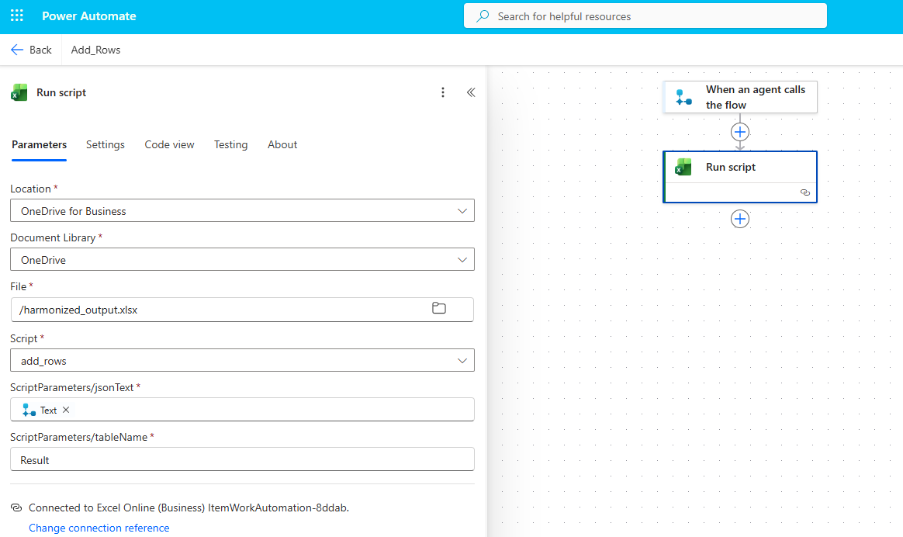
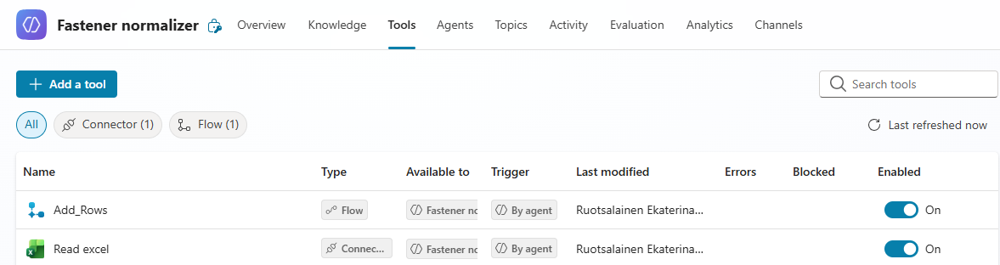
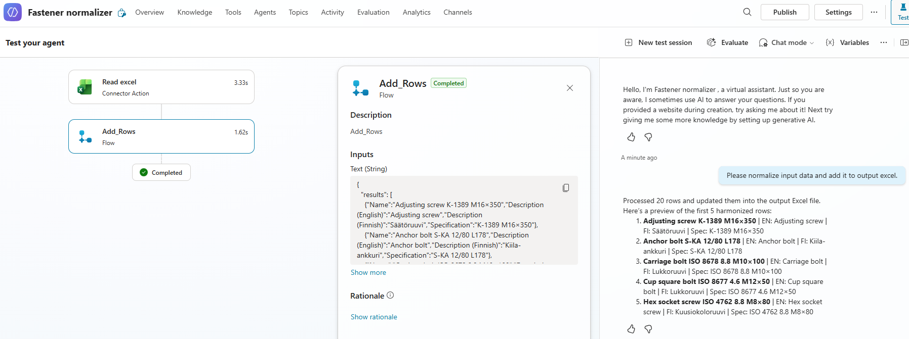

# Fastener Normalizer

A Microsoft Copilot Studio agent that reads industrial item data from Excel,
harmonizes names and descriptions against internal naming rules,
and writes the cleaned result back to Excel using Power Automate and Office Scripts.

The agent was originally built and tested for fastener items (screws, nuts, washers),
but the approach is designed to scale to other product groups with their own naming rules.

---

## Business Problem

Industrial item master data in PDM and ERP systems accumulates naming inconsistencies
over years of maintenance — across teams, systems, and migration projects.
This happens in any product category that relies on structured text fields:

- The same item type appears under several naming variants across different projects
- Standards for the same product are mixed or duplicated in one record (ISO, DIN)
- Size formats use different separators (`M8x80`, `M8 x 80`, `M80`*`80`)
- Text fields may be all-caps, sentence case, or mixed — inconsistently
- Coating and material tokens (`Zn`, `8.8`, `A4-70`) are sometimes lost or misplaced
  in the specification field

Before migrating or cataloguing these items, every record needs to be normalized to
a single consistent format. Doing this manually across hundreds of rows is slow and
error-prone.

---

## Solution

The Fastener Normalizer agent automates the harmonization step. It:

1. Reads a batch of item rows from an Excel table using the Excel Online connector
2. Parses each row: extracts standard, coating, material class, and size
3. Maps the parsed standard to canonical English/Finnish descriptions from internal rules
4. Builds a clean specification string in the prescribed order
5. Returns a preview of the first five rows in the chat and writes all results to a
   predefined output Excel file

---

## Architecture

```
User starts agent
       |
       v
Excel Online connector
List rows from table "Data"
       |
       v
Generative AI step
Parse rows → harmonize → return JSON
       |
       v
Power Automate flow
Calls Office Script with JSON payload
       |
       v
Office Script
Writes results into harmonized_output.xlsx, table "Result"
       |
       v
User sees a 5-row preview in chat
and opens the output Excel file to review all results
```

### Components

| Component | Role |
|---|---|
| Excel Online (Business) connector | Reads input rows from the source Excel table |
| Generative AI node | Parses and harmonizes each row using internal rules |
| Power Automate flow | Bridges the agent output to the Office Script |
| Office Script | Writes the JSON result array into the output Excel table |

---

## Workflow

**Flow trigger and input parameter**
*(Left: the trigger "When an agent calls the flow" with parameter `Text = aiJson` — this
is the JSON payload the agent sends to the flow. Right: the complete flow with two steps,
trigger and Run script.)*



**Run script step — output Excel configuration**
*(The Office Script step writes into `/harmonized_output.xlsx`, table `Result`, passing
the JSON text from the trigger as `ScriptParameters/jsonText`. The script is `add_rows`.)*



**Agent tools in Copilot Studio**
*(The agent has two tools enabled: `Add_Rows` (Flow) for writing results to Excel, and
`Read excel` (Connector) for reading the input rows. Both are triggered by the agent.)*



**Agent running — test environment**
*(Left: the workflow steps completed — Read excel followed by Add_Rows. Right: the chat
shows the agent confirming that 20 rows were processed and a preview of the harmonized
output.)*



---

## Harmonization Rules

### Standard selection

If an ISO standard is present, only the ISO token is kept in the output.
If no ISO is available, the single available non-ISO token (DIN, SFS, or internal) is used.

| Input standards        | Output   |
|------------------------|----------|
| DIN 912, ISO 4762      | ISO 4762 |
| DIN 603, ISO 8677      | ISO 8677 |
| DIN 916 only           | DIN 916  |
| INT-2019 only          | INT-2019 |

### Description mapping (selected entries)

| Standard            | Description (English)                        | Description (Finnish)         |
|---------------------|----------------------------------------------|-------------------------------|
| ISO 4762            | Hexagon socket head cap screw                | Kuusiokoloruuvi               |
| ISO 10642           | Hexagon socket countersunk head screw        | Kuusiokoloruuvi uppokanta     |
| ISO 4014 / ISO 4017 | Hexagon head screw                           | Kuusioruuvi                   |
| ISO 8677 / ISO 8678 | Cup square bolt                              | Lukkoruuvi                    |
| ISO 4029 / DIN 916  | Hexagon socket set screw                     | Kuusiokolopidätinruuvi        |
| ISO 4032            | Hexagon nut                                  | Kuusiomutteri                 |
| ISO 7042            | Self-locking nut                             | Jousimutteri                  |
| ISO 7089            | Plain washer                                 | Tasainen aluslevy             |

If the parsed standard has no entry in the rules, existing descriptions are kept with
only case and spacing normalized.

### Specification format

```
[Standard] [Coating/Finish] [Material/Class] [Size]
```

Coating and material tokens (`Zn`, `A2-70`, `8.8`) must not be lost. They are placed
before the size: `ISO 4762 Zn 8.8 M8×80`

---

## Example Transformation

Two rows from the demo dataset, showing the key fields before and after harmonization.

**Input (from `demo_input.xlsx`):**

| Item Code | Name | Description (EN) | Description (FI) | Specification | Standard |
|---|---|---|---|---|---|
| SYN-00006 | `SOCKET HEAD SCREW M8x80 DIN912` | `Hex socket screw` | `Kuusiokoloruuvi` | `M8x80 - 8.8` | `EN ISO 4762, DIN 912` |
| SYN-00001 | `ADJUSTING SCREW M16 x350` | `Adjusting screw` | `Säätöruuvi` | `M16x350` | `INT-2019` |

**Harmonized (from `demo_output.xlsx`):**

| Item Code | Name | Description (EN) | Description (FI) | Specification |
|---|---|---|---|---|
| SYN-00006 | `Hexagon socket head cap screw ISO 4762 8.8 M8×80` | `Hexagon socket head cap screw` | `Kuusiokoloruuvi` | `ISO 4762 8.8 M8×80` |
| SYN-00001 | `Adjusting screw INT-2019 M16×350` | `Adjusting screw` | `Säätöruuvi` | `INT-2019 M16×350` |

SYN-00006 shows standard resolution: both `EN ISO 4762` and `DIN 912` are in the input,
only `ISO 4762` is kept. SYN-00001 has an internal standard with no ISO equivalent —
it is preserved as-is.

---

## Demo Data

| File | Content |
|---|---|
| `demo_data/demo_input.xlsx` | 15 synthetic item rows with typical data quality issues |
| `demo_data/demo_output.xlsx` | Harmonized result for the same 15 rows |
| `demo_data/naming_rules_summary.md` | Simplified naming rules reference used by the agent |

The demo data is synthetic and follows the same structure and error patterns as real
legacy data. It contains no proprietary item numbers or company-specific content.
The internal standard `INT-2019` replaces a real company-internal standard code.

---

## Known Limitations

- The Office Script can write approximately 30 rows to Excel per run. The Excel Online
  connector and the AI step can process significantly more rows than that, but the current
  workflow has no mechanism to read and write the file in batches. Larger files need to be
  split manually before processing.
- Ambiguous items with no matching standard entry may need manual review of the output.
- The Excel connector setup is environment-specific (SharePoint path, table name, script ID).

---

## Possible Next Steps

- Add batch processing: split the input file automatically and process in chunks
- Add a change log sheet showing original vs. harmonized values side by side
- Add confidence or review flags per row so a human can prioritize manual checks
- Extend the naming rules to cover additional product groups beyond fasteners

---

## Interactive Simulation

A Streamlit app demonstrates the harmonization workflow using the 15-row demo dataset.
Select rows from the input table, press **Normalize**, and a side-by-side before/after
comparison shows what the agent changed in each row.

**Try it:** *(link will be added after deployment)*

---

## Tools

**Agent:** Microsoft Copilot Studio · Power Automate · Office Scripts · Excel Online (Microsoft 365)

**Simulation:** Streamlit · pandas · openpyxl
