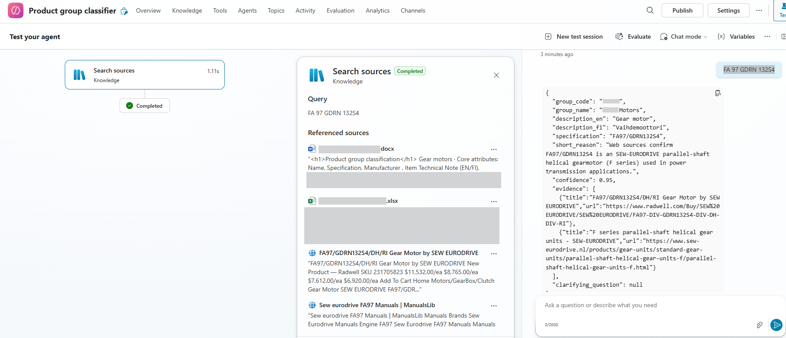

# Product Classifier

A Microsoft Copilot Studio agent that takes a vague item creation ticket,
identifies the real product type using public web search, maps it to the correct
internal product group from a reference catalogue, and returns a harmonized
description and specification in line with company naming standards.

---

## Business Problem

In industrial PDM and ERP projects, item creation requests often arrive as short,
ambiguous strings — a part number, a model code, or a rough description typed by
the requester:

```
R37DRN100LS4
AFKOVL-260-20 ABS
FC-045-H
```

Without recognizing what the product actually is, it cannot be assigned to the
correct material group, and the item record cannot be created with the right
attribute template. Misclassification causes downstream problems in procurement,
inventory, and maintenance workflows.

Resolving these tickets typically requires the item master team to look up the part
manually and decide on the group. This agent automates that lookup and returns a
structured classification decision with evidence.

---

## Solution

The Product Classifier agent takes one ticket description at a time and:

1. Runs parallel web searches (Bing) using several query variants in Finnish and English
2. Identifies the real product type from manufacturer pages, datasheets, and distributors
3. Maps the identified type to an internal group code from the reference catalogue
4. Returns a structured JSON response with the group, descriptions, specification,
   confidence score, evidence links, and — if uncertain — a clarifying question

The agent does not invent group codes. All output group codes must exist in the
internal reference catalogue.

---

## Architecture

```
User submits ticket description
              |
              v
Bing web search (4–6 parallel queries, FI + EN variants)
              |
              v
Agent parses search results
Identifies product type and model from manufacturer / datasheet / distributor pages
              |
              v
Internal knowledge lookup
Maps product type to group_code from material_groups reference
              |
              v
Structured JSON response
group_code · group_name · description_en · description_fi
specification · confidence · evidence · clarifying_question
```

### Web-first rule

The agent must perform at least one web search before deciding. If web tools are
unavailable, it returns an error rather than guessing from internal data alone.
This prevents the agent from hallucinating classifications based on token similarity.

---

## Output Schema

```json
{
  "group_code":           "internal group code (must exist in the reference catalogue)",
  "group_name":           "group name matching the code",
  "description_en":       "generic type name in English — no model numbers",
  "description_fi":       "generic type name in Finnish — no model numbers",
  "specification":        "exact model or type string from the ticket or a web source",
  "short_reason":         "1–2 sentences with the decisive identification signals",
  "confidence":           "0.00–1.00",
  "evidence":             [{"title": "page title", "url": "https://full-url"}],
  "clarifying_question":  "targeted question to resolve uncertainty, or null"
}
```

A `clarifying_question` is included when confidence falls below 0.70, targeting the
specific ambiguity the agent could not resolve from web evidence alone.

---

## Decision Logic

1. **Web search** — determine the real product type and model from public sources
2. **Group mapping** — choose `group_code` from the internal catalogue (must exist there)
3. **Descriptions** — use the canonical English/Finnish type label for the identified group
4. **Specification** — use the exact model or type string from the ticket or web source
5. **Evidence** — include real links with page title and full URL
6. **Uncertainty** — if confidence < 0.70, add one targeted clarifying question

### Disambiguation example

For ambiguous tokens (e.g., `FC-045-H` could be a filter element or an inverter keypad),
the agent runs split queries for each candidate family and prefers the one confirmed by
manufacturer or datasheet pages. If both remain credible, it asks one clarifying question
instead of guessing.

---

## Example

**Input:** `PROF-SYL.040x0125  61M-2P-040-A-0125`

**Output:**
```json
{
  "group_code": "20000",
  "group_name": "Pneumatic Cylinders",
  "description_en": "Pneumatic cylinder",
  "description_fi": "Paineilmasylinteri",
  "specification": "61M-2P-040-A-0125",
  "short_reason": "Manufacturer datasheet identifies 61M series as an ISO 15552 round-body pneumatic cylinder. Bore 40 mm, stroke 125 mm.",
  "confidence": 0.97,
  "evidence": [...],
  "clarifying_question": null
}
```

See [`demo_data/example_tickets.md`](demo_data/example_tickets.md) for five worked examples
including an ambiguous case where the agent raises a clarifying question.

**Agent running — test environment**
*(Left: the web search step (Search sources) completing. Right: the agent returns the
structured JSON classification with group code, descriptions, specification, and evidence.)*



---

## Demo Data

| File | Content |
|---|---|
| `demo_data/example_tickets.md` | 5 example tickets with full agent responses |
| `demo_data/material_groups_demo.xlsx` | 15-group subset of the internal product group catalogue |

The material groups file is synthetic demo data. Group codes and names follow the
structure used in standard industrial ERP and PDM environments. No proprietary
item data is included.

---

## Interactive Simulation

A Streamlit app demonstrates the classification workflow using the same five tickets
from `demo_data/example_tickets.md`. Pre-built examples replay real agent responses
instantly — no API call is made. For any other input, the simulation runs a live
Tavily web search and classifies the result using Claude Haiku, returning the same
JSON output format the real agent uses.

**Try it:** [Open the Streamlit simulation](https://ekaterina-25-item-classifier.streamlit.app)

---

## Known Limitations

- Classification quality depends on web search availability and result quality.
  Obscure or highly proprietary part numbers may not appear in public sources.
- Evidence links point to real pages at query time; links are not stored or verified
  after the session ends.
- The agent handles one ticket per conversation turn. Batch input is not supported.

---

## Possible Next Steps

- Add a confidence threshold that automatically escalates low-confidence items to a
  human reviewer queue
- Connect to a live item master API to check whether the suggested group already has
  similar items, supporting deduplication at creation time
- Extend the demo to cover the full internal group catalogue (~100 groups)

---

## Tools

**Agent:** Microsoft Copilot Studio · Bing Search

**Simulation:** Streamlit · Tavily · Claude Haiku (Anthropic)
